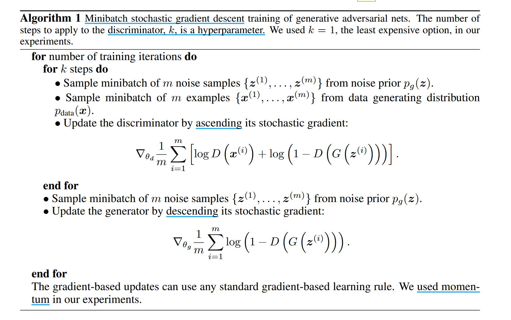

# Generative Adversarial Nets

## Induction

## Related work

## Adversarial nets

## 4 Theoretical Results

生成器 G 隐式地定义了概率分布 $p_g$ 作为 $z ~ pz$ 时得到地样本 $G(z)$ 地分布。因此，若给定足够的模型容量和训练时间，我们希望 algorithm1 收敛到 $p_{data}$ 的一个很好的估计器。

**Section 4.1** 展示了该情景具有一个 $p_g = p_{data}$ 的全局最优解，**Section 4.2** 说明了 algorithm1 优化 equation1，从而能获得了期望的结果。

### 4.1 Global Optimality of $p_g = p_{data}$

见原论文

### 4.2 Convergence of Algorith 1

见原论文

## 5 Experiments

